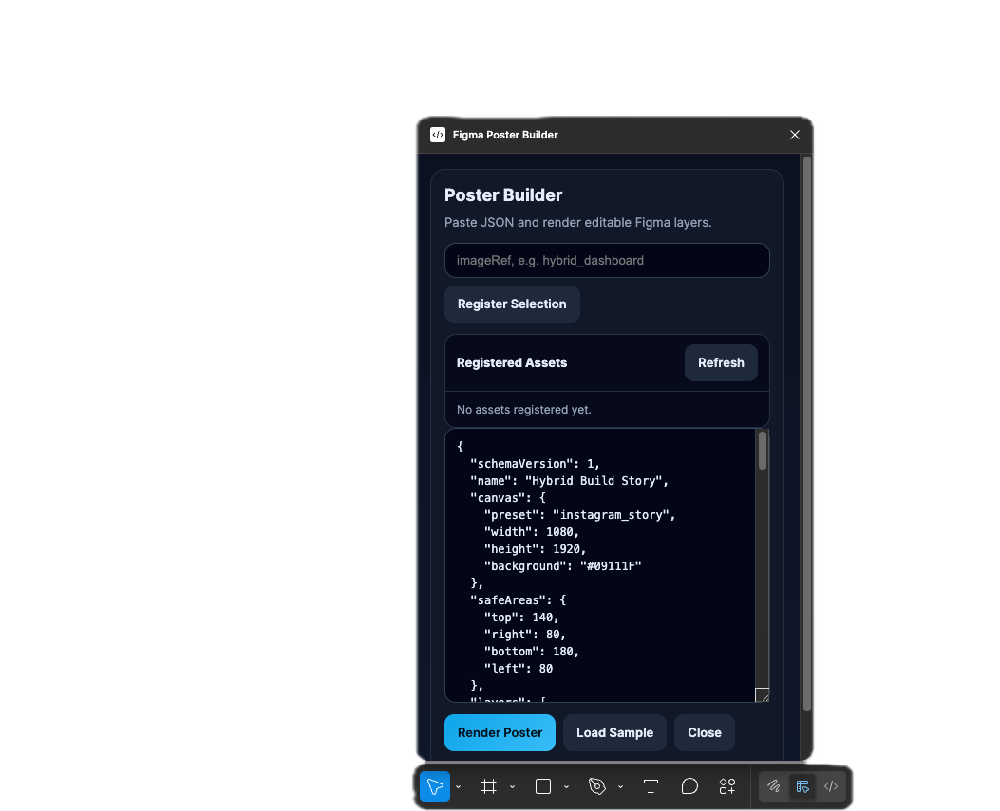
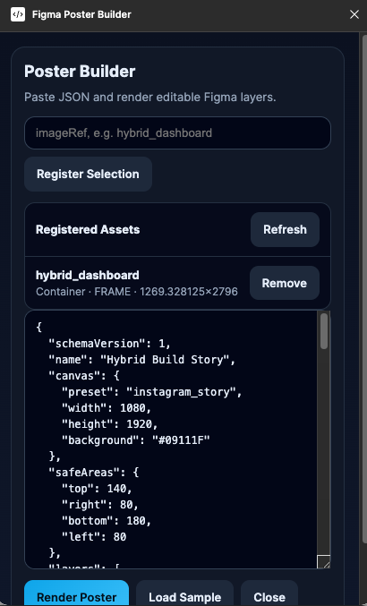
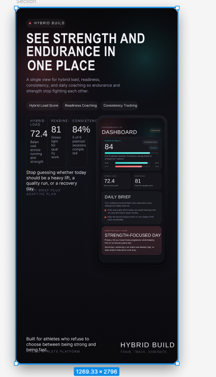

# Figma Poster Builder

Figma Poster Builder is a Figma desktop plugin for turning structured JSON into native, editable Figma marketing layouts.

Instead of generating HTML and trying to force it into Figma, you ask an LLM for JSON, paste that JSON into the plugin, and the plugin renders real Figma text, shapes, and screenshot-based compositions.

## What Problem This Solves

HTML-to-Figma workflows are usually a bad editing experience. Layers become awkward, text is hard to work with, and the output is not well suited for fast marketing iteration.

This plugin takes a different approach:

- ask an LLM for constrained poster JSON
- paste the JSON into the plugin
- render editable Figma layers directly

That means:

- editable text
- editable shapes
- reusable screenshot assets via `imageRef`
- easier iteration for App Store screenshots, Instagram stories, and similar promotional layouts

## Screenshots

### Plugin UI



### Asset Registration



### Rendered Poster



## Current Capabilities

- Create a frame with a background fill
- Render native Figma nodes for:
  - `text`
  - `rect`
  - `ellipse`
  - `line`
  - `image`
- Validate JSON before rendering
- Register selected Figma nodes as reusable `imageRef` assets
- Render screenshot-based layouts without importing HTML

## Requirements

- Figma desktop app
- A Figma design file

`Import plugin from manifest...` is a desktop-app workflow. This plugin is not meant to be loaded from the browser version of Figma.

## Installation

1. Download or clone this repo.
2. Open the Figma desktop app.
3. Open any design file.
4. In the Mac menu bar, go to `Plugins -> Development -> Import plugin from manifest...`
5. Select [`manifest.json`](./manifest.json)
6. Run `Plugins -> Development -> Figma Poster Builder`

## How To Use

There are two main workflows.

### 1. Text-and-shapes only

Use this for layouts that do not need a product screenshot.

1. Open the plugin.
2. Ask your LLM for Figma Poster Builder JSON.
3. Copy the JSON.
4. Paste the JSON into the plugin.
5. Click `Render Poster`.

### 2. Screenshot-based layouts

Use this for App Store screenshots, Instagram stories, and product marketing creative that includes your app UI.

1. Drag your app screenshot into Figma.
2. Select the screenshot node.
3. In the plugin, type a short asset key like `app_home` or `hybrid_dashboard`.
4. Click `Register Selection`.
5. Ask your LLM for Figma Poster Builder JSON that uses that same `imageRef`.
6. Copy the JSON.
7. Paste the JSON into the plugin.
8. Click `Render Poster`.

If the JSON contains an `image` layer, the `imageRef` in the JSON must match a registered asset in the plugin.

Example:

- registered asset: `hybrid_dashboard`
- JSON value: `"imageRef": "hybrid_dashboard"`

## How To Use With An LLM

This is the expected user loop:

1. Tell the LLM what kind of marketing asset you want.
2. Tell it to output JSON only using the Figma Poster Builder schema.
3. If your design includes a screenshot, tell it which `imageRef` to use.
4. Paste the returned JSON into the plugin.
5. Render and edit the result in Figma.

### Example Prompt

```text
Create a Figma Poster Builder JSON for an App Store screenshot for my fitness app.
Use preset app_store_iphone_15_pro_max.
Use imageRef "hybrid_dashboard".
Output JSON only.
```

### Example Prompt For Instagram Story

```text
Create a Figma Poster Builder JSON for an Instagram story promoting my app.
Use preset instagram_story.
Use imageRef "hybrid_dashboard".
Output JSON only.
```

## Recommended User Instructions

If you want to explain the plugin to other people, this is the short version:

1. Open Figma desktop.
2. Run the plugin.
3. If you want to use a screenshot, drag it into Figma, select it, and register it with an `imageRef`.
4. Ask ChatGPT, Claude, Codex, or another LLM to generate Figma Poster Builder JSON.
5. Paste the JSON into the plugin.
6. Click `Render Poster`.
7. Tweak the final design directly in Figma.

## Prompt Contract

The LLM schema contract lives in [`codex-poster-prompt.md`](./codex-poster-prompt.md).

That file describes:

- supported canvas presets
- supported layer types
- field rules
- image layer behavior
- design constraints

## Sample Files

- [`samples/hybrid-story.json`](./samples/hybrid-story.json)
- [`samples/hybrid-app-store.json`](./samples/hybrid-app-store.json)

## Repository Structure

- [`manifest.json`](./manifest.json): Figma plugin manifest
- [`code.js`](./code.js): plugin runtime and embedded UI
- [`ui.html`](./ui.html): original standalone UI prototype
- [`codex-poster-prompt.md`](./codex-poster-prompt.md): LLM prompt contract
- [`docs/plugin-architecture.md`](./docs/plugin-architecture.md): implementation notes
- [`samples/`](./samples): sample payloads

## Limitations

- `image` layers currently clone an existing Figma node; they do not import image files directly
- there is no re-render diff/update flow yet
- there is no auto-layout or responsive region system yet
- gradient and richer style support are still limited
- fonts must exist in Figma for text rendering to succeed

## Open Source

If you publish this project, include:

- [`LICENSE`](./LICENSE)
- clear setup instructions
- the prompt contract
- a few screenshots or demo GIFs
- sample JSON payloads

MIT is included here for simple reuse.
